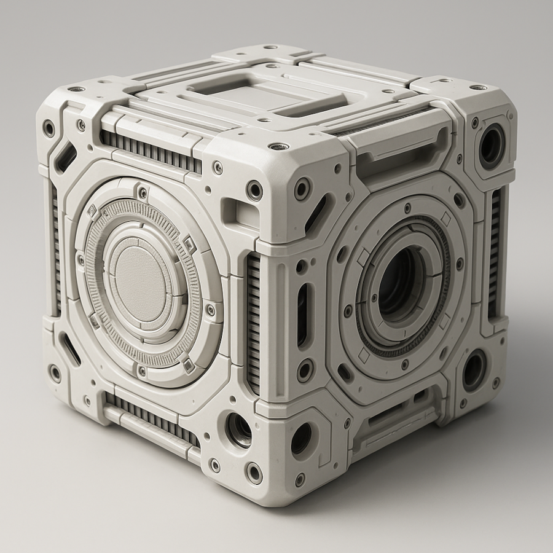
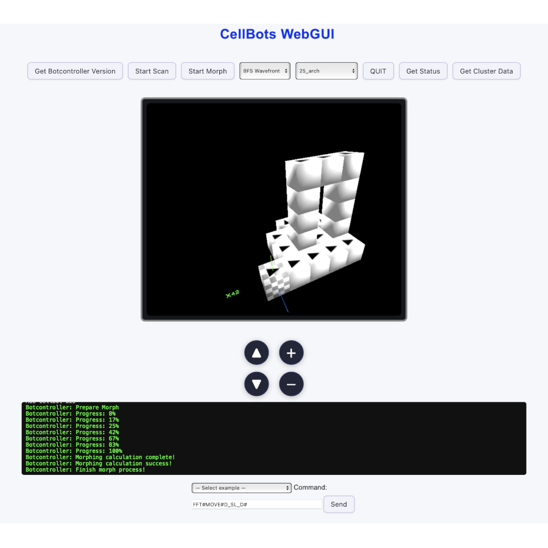
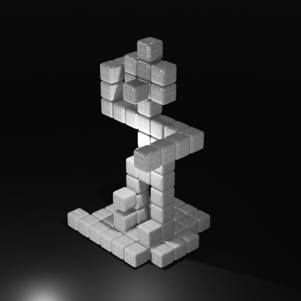

# SP-CellBots – A Simulator for Programmable Matter

Sven Pohl B.Sc. <sven.pohl@zen-systems.de> — MIT License © 2025  
This project is licensed under the [MIT License](./LICENSE).

**SP-CellBots** is an open simulation and control system for programmable matter.  
It is based on a fictional hardware model: the **SP-CellBot**, a modular unit capable of moving across identical elements, stacking, and forming fixed connections in order to *morph* into arbitrary 
structures. 

> ⚠️ Note: The term "CellBots" is used here in a descriptive, non-commercial context and is not affiliated with any external research groups or trademarks.

<strong>„Morph. Code. Forge.“</strong>

<table>
  <tr>
    <td align="center">
       
      
        AI-generated CellBot concept 
        <i>Image generated with OpenAI (ChatGPT/DALL·E)</i>
      
    </td>
    <td align="center">
       
      
        WebGUI BotController 
        (Screenshot)
      
    </td>
    <td align="center">
       
      
        Animated Blender export 
        (Rendering)
      
    </td>
  </tr>
</table>

---

## 📚 Contents

- [Description](docs/description.md)  
- [Installation & Quickstart](docs/install.md)  
- [CellBot Protocol and OP-Codes](docs/protocol.md)  
- [CellBot Hardware Blueprint (Virtual)](docs/hardware_blueprint.md)  
- [Usage & Examples](docs/usage.md)  
- [Morphing](docs/morphing.md)  
- [Blender Replay and Animation](docs/blender.md)  
- [Tools (Scripts)](docs/tools.md)  
- [Vision & Future Applications](docs/vision.md)

---

## 🧩 Version

Current version: **1.0**

---

## 📝 Changelog

- **1.0** (19.07.2025): First MVP released

---

## 🚧 Planned Features

- **MasterBot command signing:**  
  All control commands from the MasterBot will be cryptographically signed (e.g., RSA/ECDSA or HMAC).  
  Each CellBot must verify the signature before accepting a command.

- **Planned:**  
  Optional self-signing of CellBots for future authentication (not required initially).

- **Goal:**  
  Ensure authenticity of control commands; signature will always be prepended to the opcode/message.

---

## 🤝 Contributing

Pull requests are welcome!

## 💛 Support / Donate

If you enjoy this project and want to support ongoing development, feel free to send a Bitcoin donation to:

**BTC address:**  
`bc1qr49kr0cn92wmtne4tasdqe9qzfhj0jqvpxjhha`

> *"If you’d like to say thanks: Even a few sats are appreciated!"*

Thank you! 🙏
