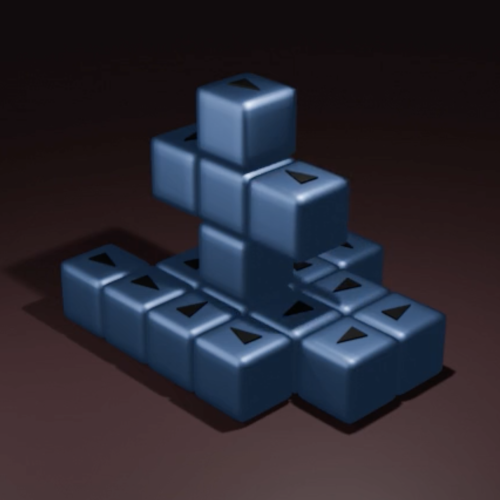

[⬅️ Back to Overview](../README.md)

# Blender

ClusterSim provides Blender logging for later replays.  
The Python script `blender_python_import_for_replay.py` was tested with **Blender Version 4.4.3**.

<table>
  <tr>
    <td align="center">
      <br>
      <sub>Blender Screenshot</sub>
    </td>
    <td align="center">
      <br>
      <sub>Blender Screenshot</sub>
    </td>
    <td align="center">
      <br>
      <sub>Animated Blender Export<br><sub>(Rendering)</sub></sub>
    </td>
  </tr>
</table>


## Python Scripts in /tools

```
.
├── base_30.json
├── base_30.xml
├── blender_python_import_for_replay.py
├── blender_python_targetdesign.py
└── generate.js
```

Set the `blenderlogging` parameter in `config.cfg` under `/cluster_sim` to true:

```
blenderlogging = true
```

The output is saved to `cluster_sim/logs/blender.txt`:

```json
[
{"event":"addbot","botid":"B29","pos":{"x":5,"y":-1,"z":1},"dir":{"vx":1,"vy":0,"vz":0},"ts":0,"color":"66ddff"},
{"event":"addbot","botid":"B30","pos":{"x":5,"y":-1,"z":2},"dir":{"vx":1,"vy":0,"vz":0},"ts":0,"color":"ffcc00"},
{"notify":"update","msg":[{"event":"move","botid":"B18","from":{"x":1,"y":-1,"z":2},"to":{"x":0,"y":-1,"z":2},"duration":300,"parent":"","ts":11296}]},
{"notify":"update","msg":[{"event":"move","botid":"B18","from":{"x":0,"y":-1,"z":2},"to":{"x":0,"y":0,"z":2},"duration":300,"parent":"","ts":11598}]},
...
{"notify":"update","msg":[{"event":"spin","botid":"B30","from":{"x":3,"y":0,"z":0,"vx":1,"vy":0,"vz":0},"to":{"x":3,"y":3,"z":0,"vx":0,"vy":0,"vz":1},"parent":"","duration":300,"ts":60268},{"event":"spin2","botid":"B18","from":{"x":4,"y":1,"z":0,"vx":1,"vy":0,"vz":0},"to":{"x":3,"y":1,"z":1,"vx":0,"vy":0,"vz":1},"center":{"x":3,"y":1,"z":0},"parent":"B30","duration":300,"ts":60268}]}
]
```

**Note:** The Blender file that uses the script `blender_python_import_for_replay.py` must contain a CellBot with the ID `templatebot` (pointing in the X-axis direction). This bot serves as the template for all other CellBots.


## Photorealistic Replay

Using the Blender export and animation scripts, you can replay morph sequences in full 3D quality — including smooth camera moves, realistic lighting, and custom materials.
This allows for true visual storytelling and detailed analysis of the morphing process.

### Intuitive Editor for Morph Targets
Blender can be used as a graphical editor to design new voxel-based morph target structures.
With the included export script (`blender_python_targetdesign.py`), any cube-based structure can be exported as a JSON array and directly used in the CellBots system.

To ensure accurate editing, simply enable **Snap mode** so cubes align perfectly to the 3D grid.

> This workflow unleashes creativity: Create, export, and morph your own structures within minutes — no coding required!

---

## Teaser

**Blender transforms CellBots** from a pure simulation into an interactive visual playground.  
All morph targets and replays are just a few clicks away.


---
[⬅️ Back to Overview](../README.md)  
**Previous chapter:** [Morphing](morphing.md) | **Next chapter:** [Tools (Scripts)](tools.md)

