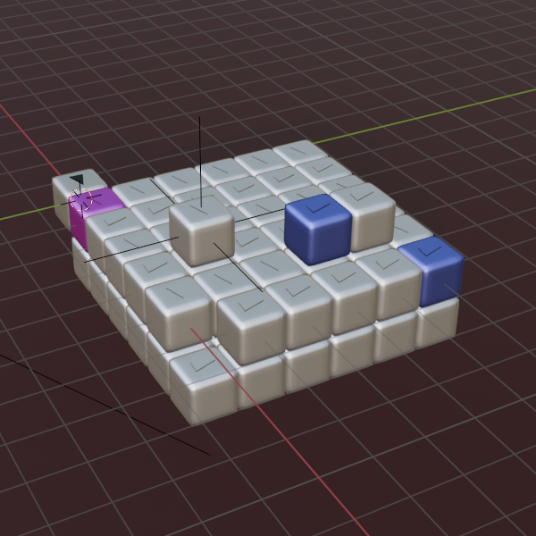

[⬅️ Back to Overview](../README.md)

# CellBot Hardware Blueprint (Virtual)

<table>
  <tr>
    <td align="center">
       
      
        AI-generated CellBot concept 
        <i>Image generated with OpenAI (ChatGPT/DALL·E)</i>
      
    </td>
    <td align="center">
       
      
        CellBot concept design 
        <i>Blender rendering</i>
      
    </td>
    <td align="center">
       
      
        AI-generated CellBot concept 
        <i>Image generated with OpenAI (ChatGPT/DALL·E)</i>
      
    </td>
  </tr>
</table>

The current CellBot project is based on a compact cube form. A future hardware implementation for programmable matter might require more or fewer than 6 "slots" to connect with neighbors, a flexibility already anticipated in the protocol.

### What does a minimal CellBot need in theory?
To morph any structure while remaining extremely small (e.g., 0.1mm edge length, "retina voxel resolution") and possibly in tardigrade scale, a CellBot might:

- Lack Wi-Fi or a large energy cell due to space constraints
- Move only one edge length per step
- Require neighboring bots to move or relay signals
- Relay only short message packets due to memory limits

In real-world usage, bots may become damaged through wear or lose power over time. The cluster must detect such inactive bots and have the ability to **remove or relocate** them to maintain full system functionality.

   
  Blender screenshot with several CellBots

### Current simulated CellBot capabilities

- **Orthogonal movement** in all six directions (F, R, B, L, T, D)
- **Double-moves** to climb, swing, or step over others
- **Rotation (spin)** 90° left/right
- **Message routing** to neighbors
- **Grabbing/transport** frontal CellBots (incl. removal)
- **Neighbor detection**, including inactive bots
- **Top/Bottom awareness**, including relative rotation vector
- **Color changes (optional)** for debugging via LEDs

> **Note:** Future simulations may include limited-mobility CellBots (e.g., only forward movement)

---

## Meta-Thoughts: Hardware Scaling and Communication Challenges

### Scalability examples:
- **10 cm bots in 1 m³** = ~1,000 bots
- **0.1 mm bots in 1 cm³** = 1 million bots

### Communication paths:
- Even small clusters require 20+ hops for a message roundtrip
- Dense clusters might involve 200+ hops for single message chains

### Challenges:
- Latency increases with each hop
- Cluster coordination becomes harder with swarm size
- Energy, addressing, and routing need smart solutions

> **Key insight:** Even tiny volumes present massive technical challenges—especially in signal transmission.

---

## Propagation Delay in Large Clusters

Assuming 50ms per hop (receive + process + forward):
- 200 hops = **10 seconds** delay

> Real-world factors like error handling or congestion may worsen this. Serial forwarding is a major bottleneck.

---

## The Real Challenge: Communication

Mechanical movement is solvable. The true challenge lies in **scalable, fast, fault-tolerant communication** across micro-scale swarms.

- Mini-bots already exist
- Coordinating them as intelligent swarms does not
- Communication problems scale **exponentially**

> Mechanical issues scale linearly. Communication complexity grows non-linearly.

---

## Inspiration: Beyond Serial Signaling

Like neural axons in biology, CellBot networks might evolve:

- **Express-bots**: Bigger, faster relay bots
- **Fiber-layers**: Deploy thin optical cables
- **Heterogeneous swarms**: Bots with varying abilities
- **Dynamic topologies**: Rewiring clusters like brain tissue

> **Future of Interconnects:**
> Integrated photonics could enable light-speed communication. Hybrid solutions may lead the next leap.

---

## Open Research Topics

- **Limited mobility & gripping angles**
- **Topology-constrained signaling**
- **Finite message buffers** (currently increased in sim to allow stress tests)

> These aren't bugs—they're real-world simulation goals for resilience and swarm learning.

---

## Vision: Specialized Bots

Imagine roles like:

- **Camouflage**: Pigment panels for invisibility
- **Actuation**: Muscle-like expansion
- **Sensing**: Light, gas, temp, distance
- **Power hubs**: Local energy distributors
- **Drilling/cutting**: Micro-scale manipulators
- **Air-cushion surfaces**: Adaptive textures

> *Maybe your phone will one day unfold itself into a laptop—powered by CellBots!*

---

## Long-Term Vision: Self-Replication

Future CellBots might:
- Harvest raw or waste material
- Reproduce autonomously
- Act as a decentralized, scalable factory

> Sci-fi concepts like Stargate's Replicators or grey goo are driving real research in robotics, nanotech, and synthetic biology.

**From simulation to self-building matter? Sooner than we think.**

[⬅️ Back to Overview](../README.md)  
**Previous chapter:** [CellBot Protocol](protocol.md) | **Next chapter:** [Usage & Examples](usage.md)

