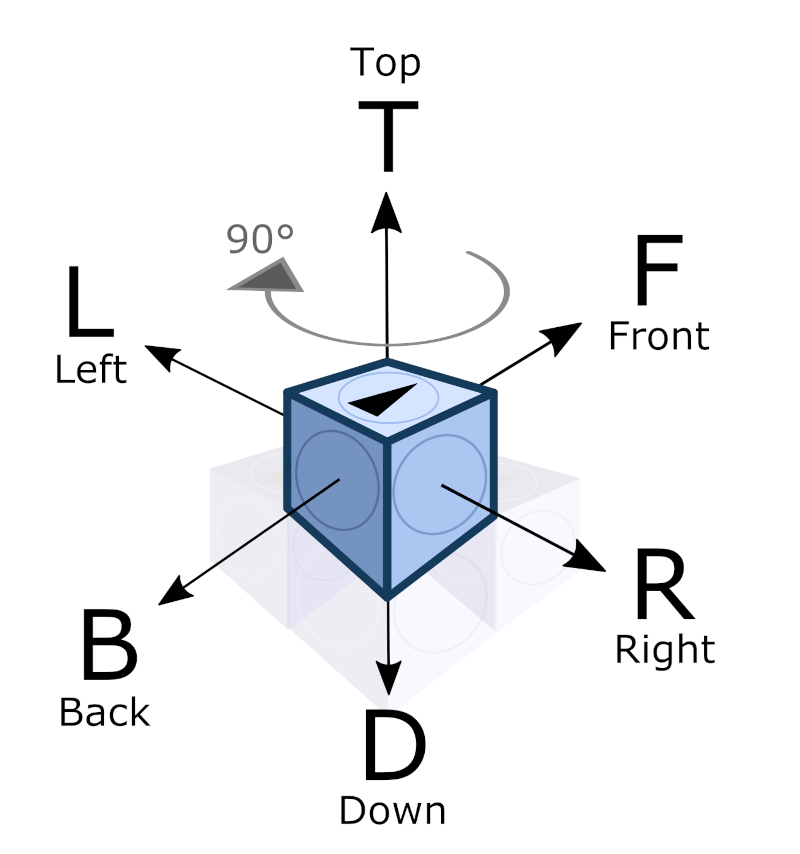

[⬅️ Back to Overview](../README.md)

# Cellbot Protocol and OP-Codes

This document provides an overview and specification of the most important CellBot commands. These commands cover areas such as scanning, messaging, localization, movement, and basic sensor data (e.g., neighbor detection).

Additional commands (e.g., "PING") also exist but are currently undocumented. While implemented, they are not relevant to the morphing or structure scan processes at the moment. These might become useful in future hardware features.

**Note:**
The list of OP-Codes is extensible. Custom commands always start with "X" and can be added as needed. Currently, such commands are used for color input (XSC) and color reading (XRC, XRRC), especially for debugging purposes. By default, all "X" commands are forwarded by any CellBot, regardless of whether they understand the command.

<center>
  
  <sub>Basic degrees of freedom</sub>
</center>

Illustration: Each CellBot has six available slots—one for each spatial direction. These slots are used to connect and communicate with other bots in the cluster (T=Top, D=Down, L=Left, R=Right, F=Front, B=Back).

# CellBot Commands – Table of Contents

1. [INFO](#1-command-info)
2. [RINFO](#2-command-rinfo)
3. [CHECK](#3-command-check)
4. [RCHECK](#4-command-rcheck)
5. [MOVE](#5-command-move)
6. [RALIFE](#6-command-ralife)
7. [SYS](#7-command-sys)
8. [X-Custom Command](#8-command-x-custom-command)
9. [Signature Mode & Message Authentication](signature-mode--message-authentication)
10. [Logging](#logging)

## 1. Command: INFO

**Purpose:**
General information request to a CellBot (without neighbor info). The MasterBot does not yet know the ID of the bot and assigns a temporary number.

**Message format:**
`[(address)#INFO#[TMPID]#(return-address)]`

**Example:**
`[F#INFO#001#S]`

- **F**: Address slot of the recipient (e.g., approached from behind)
- **INFO**: Command
- **001**: Temporary ID
- **S**: Return address to "Self" (the querying MasterBot)

`[FF#INFO#002#SR]`
`[FFR#INFO#002#SBB]`

---

## 2. Command: RINFO

**Purpose:**
Response to an INFO command with the key bot data.

**Message format:**
`[(address)#RINFO#(ID);(TMPID);(Type);(Incoming-Slot);(Vector)]`

**Example:**
`[B#RINFO#B01;001;0;B;-1,0,0]`

- `B`: Address (slot from which the reply is returned)
- `RINFO`: Response command
- `B01`: Real bot ID
- `001`: Temporary ID (as sent by the MasterBot)
- `0`: Type (e.g., 0 = standard CellBot)
- `B`: Incoming slot of the original command
- `-1,0,0`: Relative vector to the next (addressed) neighbor bot

---

## 3. Command: CHECK

**Purpose:**
Checks if a CellBot is present at a given slot (e.g., neighbor position) and whether it responds.

**Message format:**
`[(address)#CHECK#(Slot[Target])#(Return-Address)]`

**Example:**
`[F#CHECK#R#B]`

---

## 4. Command: RCHECK

**Purpose:**
Response to a CHECK command with status information about the slot.

**Message format:**
`[(address)#RCHECK#(ID);(Status)]`

**Example:**
`[B#RCHECK#B01;OK]`

**Status Codes:**

- **OK**: CellBot is functional (responds)
- **OFFL**: CellBot detected but offline
- **EMPT**: No CellBot at this position

---

## 5. Command: MOVE

**Purpose:**
Universal movement command—enables combined motor movements of a CellBot, including climbing, rotation, grabbing, and permanent connections.

**Special Notes:**
- Multiple subcommands can be separated by commas `,`
- If no return address (ALIVE) is required, the trailing `#` can be omitted
- Subcommands can include repetition counts (`...10`)
- Movement logic is based on specifying "grip points"—the MasterBot tells the CellBot where to hold on before, during, and after the move ("monkey swings from vine")

---

### Message format:

```
[(address)#MOVE#(one or more subcommands...)#(Return-Address)]
```

#### Subcommand format:

```
[Start-Anchor]_[Direction/Command]_[End-Anchor][Repetition]
```

---

### Allowed Directions & Commands
- **Orthogonal:** F (Front), R (Right), B (Back), L (Left), T (Top), D (Down)
- **Spin:** SL (Spin Left 90°), SR (Spin Right 90°)
- **Connect (Permanent):** C + slots (e.g., CLR = Connect Left and Right)
- **Grab/Transport:** GF (Grab Front), G (Release)
- **Lifesign:** LIFE (Proof-of-life at end of sequence)

---

### Movement Examples
- `D_F_D`: Move forward, grip Down before and after
- `L_F_L`: Side-hang (grip Left)
- `T_F_L`: Swing under a chain
- `D_F_D42`: Repeat 42 times
- `FFT#MOVE#D_TF_D`: Climb with top then front motion
- `FFT#MOVE#B_B_B10`: Climb up a back wall 10x
- `D_SR_D`: 90° spin right
- `[(address)#MOVE#D_F_D,LIFE#(Return-Address)]`: With proof-of-life at the end
- `[(address)#MOVE#D_F_D;CLR]`: Permanent connect on Left & Right
- `[(address)#MOVE#GF(slot)]`: Grab CellBot in front
- `FF#MOVE#NONCE;42`: Passes a nonce (e.g. counter or timestamp) for anti-replay security (future use)

---

### 🔐 NONCE (Anti-Replay Preparation)

The `NONCE` subcommand allows the master controller to include a unique number (e.g. timestamp or counter) within the `MOVE` command. Although not yet interpreted by the simulator, this field is reserved for future anti-replay validation logic. Bots may use this value to reject duplicate or stale movement commands once this feature is enabled.

---

## 6. Command: RALIFE

**Purpose:**
Proof-of-life response after completing a movement sequence (e.g., triggered by "LIFE" subcommand).

**Message format:**
`[(address)#RALIFE#(Bot-ID)]`

**Example:**
`BBL#RALIFE#B001`

---
## 7. Command: SYS

**Purpose:**  
Handles system-level commands such as security actions, configuration changes, and cryptographic operations.  
The `SYS` command supports multiple **subcommands**. Each subcommand may include parameters.  
New subcommands can be added over time without changing the base structure.

---

### 🔹 Message Format

```
[address#SYS#[Subcommand][Parameters]]
```

- **Subcommand**: A keyword indicating the system action to perform (e.g. `LOCK`)
- **Parameters**: Optional, subcommand-specific data (e.g. slot identifiers)

---

### 🔸 Subcommand: `LOCK`

**Purpose:**  
Locks or unlocks specific communication slots on the target bot.  
This can be used to block access to certain faces (e.g., outer walls) to prevent communication or movement through them.

---

#### 🧾 Usage

- `LOCK[slots]` → Locks the given slots (e.g., `FRL` = Front, Right, Left)
- `LOCK` (no parameters) → Unlocks all previously locked slots

---

### 📡 Message Examples

- Lock specific slots:
  ```
  FF#SYS#LOCKFRL
  ```
  → Locks slots `F`, `R`, and `L` on bot `FF`.

- Unlock all slots:
  ```
  FF#SYS#LOCK
  ```
  → Unlocks all previously locked slots on bot `FF`.


### 🔸 Subcommand: `UPDATEKEY`

**Purpose:**  
Updates the public key or shared secret used by a CellBot to verify message signatures.  
This enables secure key rotation and protection against replay or spoofing attacks.

---

### 📟 Usage

- `UPDATEKEY[type][key]`  
  Updates the current verification key with a new one.

---

### 🔐 Key Types

| Code | Algorithm  | Description                      |
|------|------------|----------------------------------|
| `01` | HMAC       | Shared secret (hex string)       |
| `02` | ED25519    | Base64-encoded public key        |
| `03` | RSA        | PEM-like public key (multi-part) |

---

### 📦 RSA Format Notes

- RSA keys are split using the `|` character to allow safe transport of multi-line keys.
- Format example:
  ```
  FF#SYS#UPDATEKEY03PEM|<line1>|<line2>|...|<lineN>
  ```
- The CellBot reconstructs the original PEM-style key internally.

---

### 📡 Message Examples

#### 🔸 HMAC Key Update
```
FF#SYS#UPDATEKEY01f3573fc481087cd80aa60ed72d6197180712c1a1b318d87fb0a7473566b3919c
```

#### 🔸 ED25519 Key Update
```
FF#SYS#UPDATEKEY02X3wjg+AEDHHTu99/0UYlfkvJVkEPhJjP0y5Aa39Bj34=
```

#### 🔸 RSA Public Key Update
```
FF#SYS#UPDATEKEY03PEM|MIIBIjANBgkqhkiG9w0BAQEFAAOCAQ8AMIIBCgKCAQEArb/fDWScRvlgNj12A22y|GRCjtvSkMxMYRSnaLnEyWbOPVU+EEtV7UVRPEE6ZoDkFOWKJnkN459jGyG+/7hfR|afHKywCi3SGkEGnOg42onpUU6k/j89n1jjQ/KdmY+4zZMmI9TJABU/dXzr8KyjNj|xgUJB3rz6wMwZm4COsLOlXt9+vKSCL8++zaa19Eno0PjavEQ2lFUBHUm1QJoSRR6|X3Lk4tPBKJqac7U6dzZwGPL40qsZ6Xw51wJDEtRyYpBluzwC4yceuWwHU3D8utAy|Uqh19i5DdniAym1z9xPN11e+SfZ9l3CQiaGrwxwG8rz2qvh5eYmnyE/BsUxaubzH|sQIDAQAB
```

---

🛡️ *Note: This subcommand is intended to be used by the master controller only. Bots must validate the origin of this message before accepting new keys.*


---

## 8. Command: X-Custom Command

**Purpose:**
Allows developer-defined special commands. All custom commands start with **"X"**. Unknown X-commands are forwarded by default unless blocked by hardware.

---

### Message format:

```
[(address)#X[CUSTOM-COMMAND]#(PARAMETERS)#(Return-Address)]
```

## 🔧 8. Command: `X-Custom` (Developer-Defined)

**Purpose:**  
Enables custom, developer-defined commands.  
All custom commands **start with `X`** and are forwarded by default (unless explicitly blocked by hardware or software filters).

---

### 📡 Message Format

```
[address#X[CUSTOM-COMMAND]#(PARAMETERS)#(Return-Address)]
```

---

### 💡 Note on Parameters

Parameters can be **plain strings** or **JSON-formatted strings**.

This allows complex payloads to be encoded and parsed more easily.

> ✅ Example with JSON as parameter:
> 
> ```
> FFF#XDUMMY#{"dummy": "ok", "x": 42, "parameter1": "this is a test1"}#FFF
> ```

Make sure that:
- JSON is **properly escaped** if embedded in other formats
- Your parser can handle both **raw** and **structured** inputs


### Examples:

**Set Color (Red):**
```text
[F#XSC#ff0000]
```

**Read Color:**
```text
[F#XRC#B]
```

**Color Response:**
```text
[F#XRRC#B11;ff0000]
```

---


## Signature Mode & Message Authentication

**Purpose:**  
To ensure message authenticity and prevent forgery or replay attacks, the CellBot protocol supports **signed messages** using HMAC, ED25519, or RSA. This mechanism can be enabled in both the `BotController` and `ClusterSim` by editing the shared `config.txt`.

---

### 🔧 Configuration (`config.txt`)

```ini
# Signing – use /tools/keygen.js to generate your own keypairs!
enable_signing = true

# Choose signature method (only one active at a time)
# signature_type = HMAC
# public_key_or_secret = c25f5d256a3a0104c9eabab81f6d87abc2f9f75179101de2f527de535f2b1fb3
# private_key_or_secret = c25f5d256a3a0104c9eabab81f6d87abc2f9f75179101de2f527de535f2b1fb3

signature_type = ED25519
public_key_or_secret = Rp00Q8Tg9tskf2T7+2Z82QW2sSk6YxGHXgeSSPmZnKk=
private_key_or_secret = hTquDf4nUhARvYqfcE72/qHBMt2En09xqrFUiNa3VtVGnTRDxOD22yR/ZPv7ZnzZBbaxKTpjEYdeB5JI+ZmcqQ==

# signature_type = RSA
# public_key_or_secret = PEM|MIIBIjANBgkqhkiG9w0BAQEFAAOCAQ8AMIIBCgKCAQEAvyjTEmO06IGwVUfPvvkE|...|KwIDAQAB
# private_key_or_secret = PEM|MIIEvQIBADANBgkqhkiG9w0BAQEFAASCBKcwggSjAgEAAoIBAQC/KNMS...K5OP4=
```

- If `enable_signing = false`, no signature is added.
- If enabled, every OP-code message will be signed before transmission.

---

### 📄 Message Format with Signature

When signing is active, the message is prepended with:

```
[prefix][signature_type][base64_signature]@[OP-CODE-MESSAGE]
```

- `b*` or similar prefix = ingoing slot
- `signature_type`: `01` = HMAC, `02` = ED25519, `03` = RSA
- `@` separates signature from original OP-Code payload

**Example:**
```
b*02IOXVdoBU08NORLaaTe5JkYKTO9vLNRndF6ZXddpOfzAtbKiLwvKboSb5sf4jbwiuwqNyuh0F+VMbc+fQlGFiAQ==@LLFFF#MOVE#R_TR_D;D_R_D;D_B_D;D_B_D;D_TB_D;ALIFE;sig3#DDLRBBB
```

---

### 🔐 What is signed?

Only the OP-Code message is signed, **not** the routing prefix. Example signed payload:
```
MOVE#R_TR_D;D_R_D;D_B_D;D_B_D;D_TB_D;ALIFE;sig3#DDLRBBB
```

If present, the `NONCE` subcommand may be included in the signed payload to strengthen anti-replay protection.

---

### 🚫 Signature Validation

- CellBots must **validate the signature** before executing a message.
- Messages with invalid or missing signatures (if signing is enabled) are **rejected silently**.
- The `SYS#UPDATEKEY` command itself must also be signed with the current key.
- As long as bots are uncompromised, only valid messages from the master will be accepted.

---

### 🧪 Development Mode

In development mode, it is recommended to keep:
```
enable_signing = false
```
so that log files (`log.txt`) remain easier to read.

You may enable signing at any time during runtime testing.


---

## Logging

Both **ClusterSim** and the **BotController** have a logging function (`logger.js`). This can supplement or replace `console.log()` and is particularly useful for analyzing bot communication.

### In-Code Usage
```js
Logger.log("Start cluster_sim");
Logger.reset();
```

Logs are stored in `/logs/log.txt`, cleared automatically on startup.

---

## Architecture: Hardware-Agnostic by Design

A core principle of this project is that the **BotController never depends on simulation details**:

- It communicates with the MasterBot (real or simulated) via a clean protocol.
- All visualization (colors, animation) is handled by ClusterSim.
- BotController only sees start/end positions, optionally explicit data via commands like `XSC`.

**Advantage:** Real hardware can replace the simulation without touching the controller code.

> The BotController does not care whether it talks to a virtual or physical MasterBot. This ensures modularity and future-proof design.

[⬅️ Back to Overview](../README.md)
**Previous:** [Installation & Quickstart](install.md) | **Next:** [CellBot Hardware Blueprint (Virtual)](hardware_blueprint.md)

