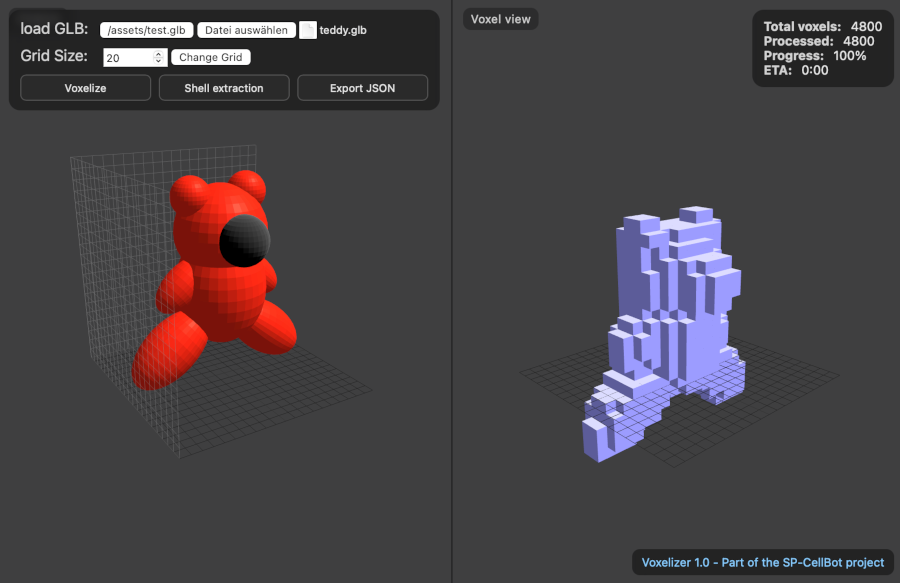

[⬅️ Back to Overview](../README.md)  

# 🧰 Tools

The **`/tools`** directory contains supplementary scripts and utilities  
that are **not part of the core** of ClusterSim or BotController,  
but provide important additional functionality.

---

## 🎞️ `blender_python_import_for_replay.py`

This Python script enables the **import of motion logs into Blender**  
and generates an animated visualization of the morphing process.  
Tested with **Blender version 4.4.3**.

---

## 🎯 `blender_python_targetdesign.py`

This tool allows you to **interactively design your own structures**  
and export them as a JSON file.

- The result is a file like `base_[xyz].json`
- This file can be placed under **`/structures`** in the BotController directory
- It will then appear **automatically in the WebGUI** as a selectable structure

This makes it easy to design morph targets directly in Blender  
and use them later within the controller.

---

📌 More tools are planned, such as:
- Timeline analysis  
- OP-Code optimization  
- Visualization of complex moves

---

## 📁 Directory structure – `tools`

```
.
├── base_30.json
├── base_30.xml
├── blender_python_import_for_replay.py
├── blender_python_targetdesign.py
└── generate.js
```

---

# ⚙️ `generate.js`

ClusterSim requires a valid **start configuration** of CellBots.  
This configuration is stored in the file **`cells.xml`** and referenced in **`config.txt`** as the active structure.

Typically, these are small stack-like configurations – e.g.,  
**25**, **40**, or **72 CellBots**, depending on the test scenario.

---

## 🧱 Creating a custom configuration

If you want to define how many CellBots should be placed in  
**width**, **height**, and **depth**,  
you can use the tool **`/tools/generate.js`**.

This script will automatically generate a corresponding **`cells.xml`**  
based on your chosen dimensions.

This makes it easy to create individual start setups in seconds – ideal for:

- Testing unusual geometries  
- Performance experiments with large clusters  
- Developing new morph algorithms with flexible starting layouts

```js
// ==== PARAMETERS ====
const width  = 5;   // x-direction
const depth  = 3;   // z-direction
const height = 2;   // y-direction (number of layers)
```

---

### Example of a generated `cells.xml`

```xml
<xml>

<masterbot>
  <id>MASTERBOT</id>
  <pos>
    <x>0</x>
    <y>0</y>
    <z>0</z>
    <vx>1</vx>
    <vy>0</vy>
    <vz>0</vz>
  </pos>
  <mbconnection>f</mbconnection>
</masterbot>

<cell>
  <id>B01</id>
  <pos>
    <x>1</x>
    <y>0</y>
    <z>0</z>
    <vx>1</vx>
    <vy>0</vy>
    <vz>0</vz>
    <col>fffffff</col>
  </pos>
</cell>

</xml>
```

---
# Voxelizer
Voxelizer 1.0 - Part of the [SP-CellBot](https://github.com/svenpohl/sp-cellbots) project

Also available in a separate repository: [Voxelizer](https://github.com/svenpohl/voxelizer)



**Voxelizer** is a **Three.js**-based tool for voxelizing 3D objects in **GLB format**.  
It is designed as a preprocessing step for generating 3D target structures for the [SP-CellBots](https://github.com/svenpohl/sp-cellbots) project.  
The tool converts a loaded 3D model into a connected voxel structure that can later be loaded into the CellBots simulation and “morphed” by simulated bots.

---

## Changelog
### [1.0] - 2025-08-11

Initial release: GLB import, grid size, shell extraction, progress, JSON export.

 
---

## ✨ Features

- **GLB file import** (only `.glb` format)
- **Configurable voxel grid size** (default: `10×10×10`)
- **Inside/outside detection** using raycasting in 6 axis directions
- **Optional Shell Extraction**:
  - Removes all inner voxels
  - Keeps only the outer shell  
  - Ensures each voxel has at least one orthogonal neighbor
- **Progress display** with percentage and estimated remaining time (ETA)
- **Dual view**:
  - **Left:** Original model (zoom and rotate with mouse)
  - **Right:** Voxelized model
- **JSON export** in simple coordinate form:
  ```json
  [
    { "x": 0, "y": 2, "z": 2 },
    { "x": 0, "y": 3, "z": 2 },
    { "x": 0, "y": 3, "z": 3 },
    { "x": 1, "y": 1, "z": 1 }
  ]
  ```

---

## 📦 Installation

1. Clone the repository:
   ```bash
   git clone https://github.com/yourusername/voxelizer.git
   cd voxelizer
   ```

2. Install dependencies:
   ```bash
   npm install
   ```

---

## 🚀 Usage

Start the local server:
```bash
node voxelizer.js
```

Open the frontend in your browser:
```
http://localhost:5174
```

**Workflow:**
1. Load a `.glb` file (e.g., from `assets/teddy.glb` or `assets/test.glb`).
2. Adjust grid size if needed.
3. (Optional) Enable **Shell Extraction** to keep only the outer shell voxels.
4. Start voxelization — progress will be displayed.
5. Download the generated `.json` file containing voxel coordinates.

---

## 🖼 Example

- **Left panel:** Original 3D model  
- **Right panel:** Voxelized model  
- Progress bar shows voxelization percentage.

---

## 📄 License

This project is licensed under the [MIT License](LICENSE).

---
[⬅️ Back to Overview](../README.md)  
**Previous chapter:** [Blender replay and animation](blender.md) |   
**Next chapter:** [Vision & future applications](vision.md)
