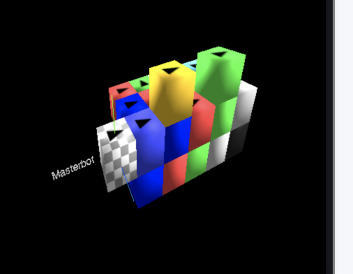
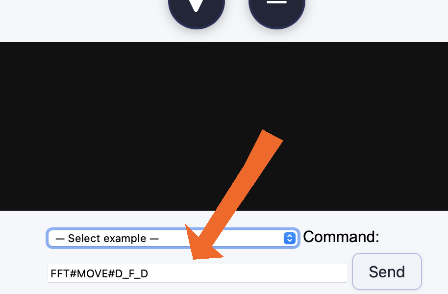

[⬅️ Back to Overview](../README.md)

# Usage

ClusterSim and BotController form the operating system, protocol simulation, and development lab for CellBots.

### 🎯 Purpose of the Software

- Algorithm sandbox
- Visual simulation environment with embedded units
- Future integration of graph-theoretic modules
- Testing of morphing algorithms

A quick overview and setup of simple morph structures is covered here:\
[Installation & Quickstart](install.md)

Below you'll find notes on specific applications and useful edits for the software.

---

## 📁 Directory Structure – `cluster_sim`

```
/cluster_sim
├── bot_class.js
├── cluster_sim.js
├── cmd_parser_class.js
├── config.cfg
├── constructs/
│   ├── base_25.xml
│   ├── base_30.xml
│   ├── base_72.xml
│   ├── cells_move.xml
│   └── cells.xml
├── logger_blender.js
├── logger.js
├── logs/
│   ├── blender.txt
│   └── log.txt
├── masterbot_class.js
├── node_modules/
│   ├── sax/
│   ├── ws/
│   ├── xml2js/
│   └── xmlbuilder/
├── package-lock.json
├── package.json
└── webguisim/
    ├── index.html
    └── js/
```

---

## 📁 Directory Structure – `botcontroller`

```
/botcontroller
├── bot_class_mini.js
├── botcontroller_class.js
├── botcontroller.js
├── botexport.json
├── cmd_parser_class.js
├── config.cfg
├── log.txt
├── logger.js
├── logs/
│   ├── botexport.json
│   └── morphresult.json
├── morph/
│   ├── morph_base.js
│   └── morph_bfs_wavefront.js
├── node_modules/
│   └── ws/
├── package-lock.json
├── package.json
├── self_assembly.js
├── sequences/
│   ├── demo.sequence
│   ├── morph.sequence
│   └── test.sequence
├── structures/
│   ├── 25_arch.json
│   ├── 25_cross.json
│   ├── 72_stick_figure.json
│   ├── base_16.json
│   ├── base_25.json
│   ├── base_30.json
│   ├── base_72.json
│   ├── pyramid.json
│   ├── ring.json
│   ├── snake.json
│   ├── spintest.json
│   ├── tower.json
│   ├── vase.json
│   ├── wall.json
│   └── well.json
└── webguicontroller/
    ├── index.html
    └── js/
```

---

# 🧭 BotController – Command Line Parameters

Command line parameter processing happens in:

**`botcontroller_class.js`**

The core logic is implemented in:

**`connect_to_external_masterbot()`**

Within the `` block, there are some commented **example commands**\
which can be sent to **ClusterSim** for testing communication.

---


# 🕹️ Executing MOVE Commands via BotController WebGUI

<table>
  <tr>
    <td align="center">
      <br>
      <sub>Move and spin – Setting</sub>
    </td>
    <td align="center">
      <br>
      <sub>Enter some OP-Codes and run</sub>
    </td>
  </tr>
</table>

## 🧪 Goal: Test Spin and Transport Commands

The **WebGUIController frontend** includes a few prepared OP-Code examples for quick experimentation.

👉 **Requirement:**\
Morph the `move_and_spin_test` structure from base config.\
Two CellBots will be placed near the MasterBot.

---

## 👁️ Visibility Note

Movements are currently **only visible in the 3D frontend of ClusterSim**\
because they do **not generate ALIFE instructions**.\
BotController needs a **re-scan** to display updated positions.

---

## 🧭 Example: Move and Approach

```plaintext
FFT#MOVE#D_F_D
```

The first bot moves toward the neighboring bot.

It then typically changes address to:

```plaintext
FFFT
```

or

```plaintext
FFRT
```

(depending on the orientation of the lower CellBot)

---

## 🦾 Example: Grab and Spin

```plaintext
FFFT#MOVE#GF;D_SL_D#
```

- `GF` → Grab the CellBot in front
- `SL` → Spin Left: rotate carrier and load by 90°
- The carrier bot’s coordinate remains **unchanged**
- The command can be **repeated indefinitely**
- The bot continues to carry its "cargo" like a diligent ant until it receives an empty `G` (release) command

---

## 🚫 Limitation (currently)

ClusterSim only supports **grabbing in front (F direction)**.

> **Why this restriction?**\
> Grabbing will likely be an expensive function in future hardware.\
> Limiting it to one direction makes sense as a starting point.

---

## 🔧 Relevance for Repair Scenarios

Transporting a CellBot is central to future **self-healing algorithms**.

In real scenarios with **thousands of CellBots**, not all bots will always function correctly.

> System goal:\
> **Self-organized fault management**\
> – Detect broken units\
> – Remove from critical zones\
> – Replace with functional bots

This type of **fault tolerance via transport** may be a key to\
real-world deployment of morphogenic robotics in complex environments.

---

[⬅️ Back to Overview](../README.md)\
**Previous chapter:** [CellBot Hardware Blueprint (Virtual)](hardware_blueprint.md) | **Next chapter:** [Morphing](morphing.md)

